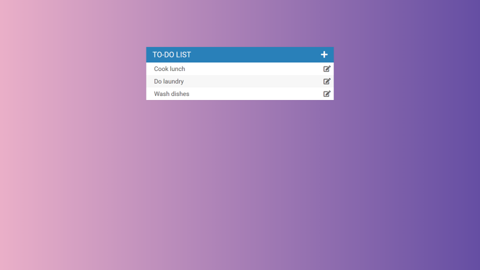
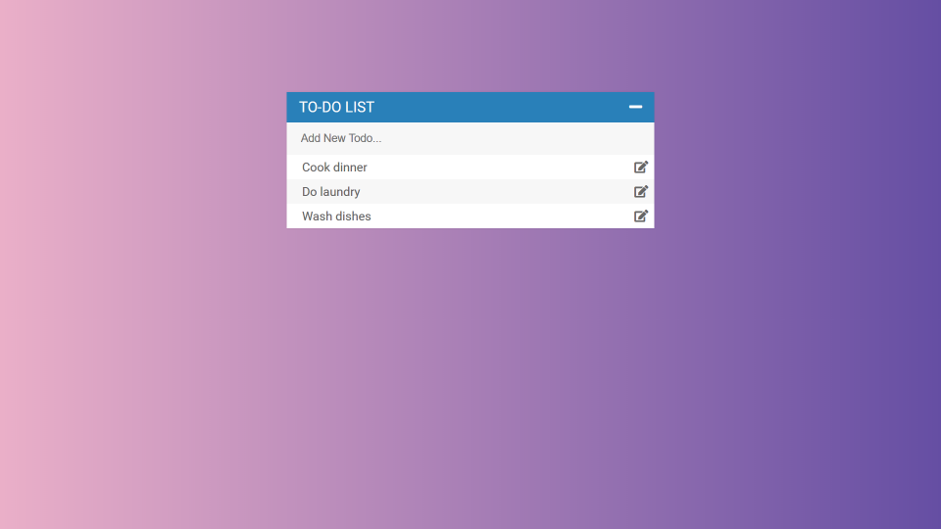
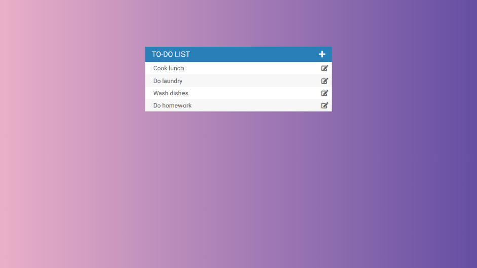
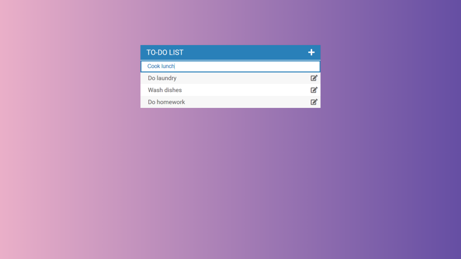
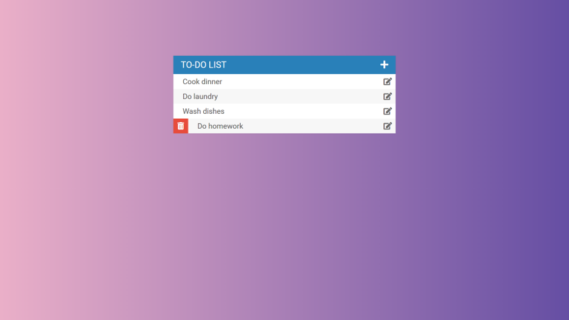

# Todo_List_Project
 A todo list using Node.js, MongoDB and Swagger API
 
 Used Expressjs as the framework for Node.js, and MongoDB as database.
 
 Created and modified RESTful API document through Swagger, and used AJAX to make API calls in the application.
 
 Connected to MongoDB using Mongoose, and implemented CRUD operations on the todo data.
 
 How to use:

Click the add sign to reveal the add todo box.

Write down a new todo item and then click the Enter key to add the new todo item to todo list.

Click the edit icon on the right to edit a todo item.

Change the todo item and then click the Enter key to edit a todo item.

Hover on the todo item and click the red trash icon on the left to delete a todo item.

